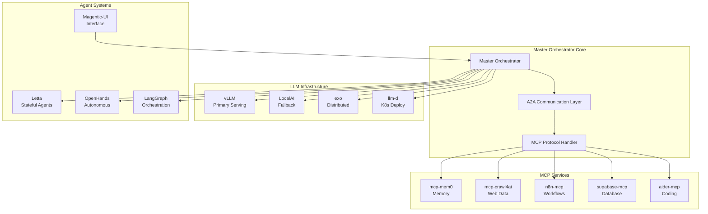

# Comprehensive GitHub Repository Analysis for Master Orchestrator Integration

## Executive Summary

This analysis covers 120+ repositories in the GitHub folder, identifying key technologies and integration opportunities for the Master Orchestrator. The ecosystem includes advanced AI frameworks, LLM serving infrastructure, MCP implementations, and autonomous agent systems that can significantly enhance the Master Orchestrator's capabilities.

## New Repositories Since Previous Analysis

### MCP (Model Context Protocol) Implementations
1. **mcp-mem0** - Long-term memory for AI agents via MCP
2. **mcp-crawl4ai-rag** - Web crawling and RAG capabilities via MCP
3. **n8n-nodes-mcp** - MCP client for n8n workflows
4. **supabase-mcp** - Database operations via MCP
5. **aider-mcp-server** - Offload coding tasks to Aider via MCP

### Local LLM Infrastructure
1. **vllm** (87M) - High-performance LLM serving with PagedAttention
2. **LocalAI** (68M) - Drop-in OpenAI replacement for local inference
3. **exo** (22M) - Distributed inference across heterogeneous devices
4. **llm-d** (6.5M) - Kubernetes-native distributed inference

### Agent Frameworks & Tools
1. **letta** (51M) - Stateful agents with long-term memory (formerly MemGPT)
2. **magentic-ui** (38M) - Human-centered multi-agent interface
3. **OpenHands** (261M) - Autonomous software development agents
4. **single-file-agents** (6.6M) - Focused single-purpose agents

### Data & Knowledge Management
1. **mem0** (63M) - Memory layer for personalized AI
2. **memfree** (98M) - Hybrid AI search engine
3. **gpt-researcher** (56M) - Deep research agent
4. **crawl4ai** (300M) - LLM-friendly web crawler

## Repository Categories

### 1. Agent Frameworks (Primary Integration Targets)

#### Core Multi-Agent Systems
- **autogen** (245M) - Microsoft's multi-agent framework with AutoGen Studio
- **langgraph** (566M) - LangChain's stateful agent orchestration
- **letta** - Advanced memory management for agents
- **MetaGPT** (223M) - Multi-agent meta programming framework
- **AgentVerse** (275M) - Simulation framework for agents

#### Specialized Agent Systems
- **OpenHands** - Autonomous coding with browser control
- **magentic-ui** - Co-planning and co-tasking interface
- **Devon** (145M) - AI software engineer
- **gpt-pilot** (434M) - AI developer companion

### 2. MCP Infrastructure (Critical for Integration)

- **mcp-mem0**: Memory persistence across sessions
- **mcp-crawl4ai-rag**: Web content ingestion and RAG
- **n8n-nodes-mcp**: Workflow automation integration
- **supabase-mcp**: Database operations
- **aider-mcp-server**: Code generation delegation

### 3. Local LLM Serving (Performance Layer)

- **vllm**: State-of-the-art serving throughput
  - PagedAttention for memory efficiency
  - Continuous batching
  - Multiple quantization support
  
- **LocalAI**: Complete OpenAI alternative
  - Multi-model support
  - Local deployment
  - REST API compatible

- **exo**: Distributed inference
  - P2P device connectivity
  - Dynamic model partitioning
  - Heterogeneous hardware support

- **llm-d**: Kubernetes-native serving
  - KV-cache aware routing
  - Disaggregated serving
  - Auto-scaling

### 4. UI/Interface Tools

- **magentic-ui**: Advanced agent interaction
  - Co-planning interface
  - Action guards
  - Plan learning/retrieval
  
- **AgentGPT** (142M): Web-based agent UI
- **memfree**: Hybrid search interface
- **Flowise** (101M): Drag-drop LLM flows

### 5. Data Processing & RAG

- **crawl4ai**: Advanced web crawling
  - 6x faster performance
  - LLM-optimized markdown
  - Browser automation
  
- **mem0**: Intelligent memory layer
  - Multi-level memory
  - Adaptive personalization
  - Cross-platform SDKs

- **gpt-researcher**: Research automation
  - Multi-source aggregation
  - Report generation
  - Deep research capabilities

### 6. Development Tools

- **aider** (229M): AI pair programming
- **single-file-agents**: Focused task agents
- **pydantic-ai-github-agent**: Repository analysis
- **claude-code** (325M): Claude CLI integration

## Integration Opportunities

### 1. Immediate MCP Integration (Phase 1)
```yaml
Priority: HIGH
Components:
  - mcp-mem0: Long-term memory across all agents
  - mcp-crawl4ai-rag: Web knowledge ingestion
  - n8n-nodes-mcp: Workflow orchestration
  - supabase-mcp: Centralized data storage
  - aider-mcp-server: Delegated code generation
```

### 2. Local LLM Infrastructure (Phase 2)
```yaml
Priority: HIGH
Components:
  - vllm: Primary inference engine
  - LocalAI: Fallback and specialized models
  - exo: Edge device utilization
  - llm-d: Kubernetes deployment
```

### 3. Agent Enhancement (Phase 3)
```yaml
Priority: MEDIUM
Components:
  - letta: Stateful agent memory
  - magentic-ui: Human-in-the-loop interface
  - OpenHands: Autonomous task execution
  - langgraph: Complex workflow orchestration
```

### 4. Knowledge & Search (Phase 4)
```yaml
Priority: MEDIUM
Components:
  - crawl4ai: Real-time web data
  - mem0: Personalized knowledge base
  - gpt-researcher: Deep research tasks
  - memfree: Unified search interface
```

## Recommended Architecture



## Implementation Roadmap

### Phase 1: MCP Foundation (Week 1-2)
1. Implement MCP protocol handler in Master Orchestrator
2. Deploy all 5 MCP servers (mem0, crawl4ai, n8n, supabase, aider)
3. Create unified MCP service registry
4. Implement A2A communication for MCP coordination

### Phase 2: LLM Infrastructure (Week 3-4)
1. Deploy vLLM as primary inference engine
2. Configure LocalAI as fallback/specialized model server
3. Set up exo for distributed inference
4. Prepare llm-d for production Kubernetes deployment

### Phase 3: Agent Integration (Week 5-6)
1. Integrate Letta for stateful agent management
2. Deploy OpenHands for autonomous execution
3. Implement LangGraph for complex workflows
4. Create Magentic-UI frontend

### Phase 4: Knowledge Layer (Week 7-8)
1. Deploy crawl4ai for real-time web data
2. Integrate mem0 for personalized knowledge
3. Set up gpt-researcher for deep research
4. Create unified search with memfree

## Key Technologies Summary

### Languages & Frameworks
- **Python**: Primary language (90% of repos)
- **TypeScript/JavaScript**: UI and web components
- **Go**: LocalAI, infrastructure tools
- **Rust**: Performance-critical components

### AI/ML Frameworks
- **LangChain/LangGraph**: Agent orchestration
- **AutoGen**: Multi-agent collaboration
- **Pydantic**: Data validation and AI integration
- **vLLM**: High-performance serving

### Infrastructure
- **Docker**: Containerization (all major projects)
- **Kubernetes**: Production deployment
- **PostgreSQL/Supabase**: Vector storage
- **Redis**: Caching and state management

## Recommendations

1. **Start with MCP**: The MCP ecosystem provides immediate value with minimal integration effort
2. **Prioritize vLLM**: For production LLM serving, vLLM offers the best performance
3. **Use Letta for Memory**: Comprehensive memory management out of the box
4. **Leverage Existing UI**: Magentic-UI provides battle-tested human-in-the-loop features
5. **Gradual Integration**: Phase approach allows testing and validation at each step

## Conclusion

The GitHub repository collection provides a comprehensive ecosystem for building an advanced Master Orchestrator. The combination of MCP services, local LLM infrastructure, and sophisticated agent frameworks creates a powerful foundation for autonomous, intelligent system orchestration. The recommended phased approach ensures stable integration while maximizing capability enhancement at each stage.